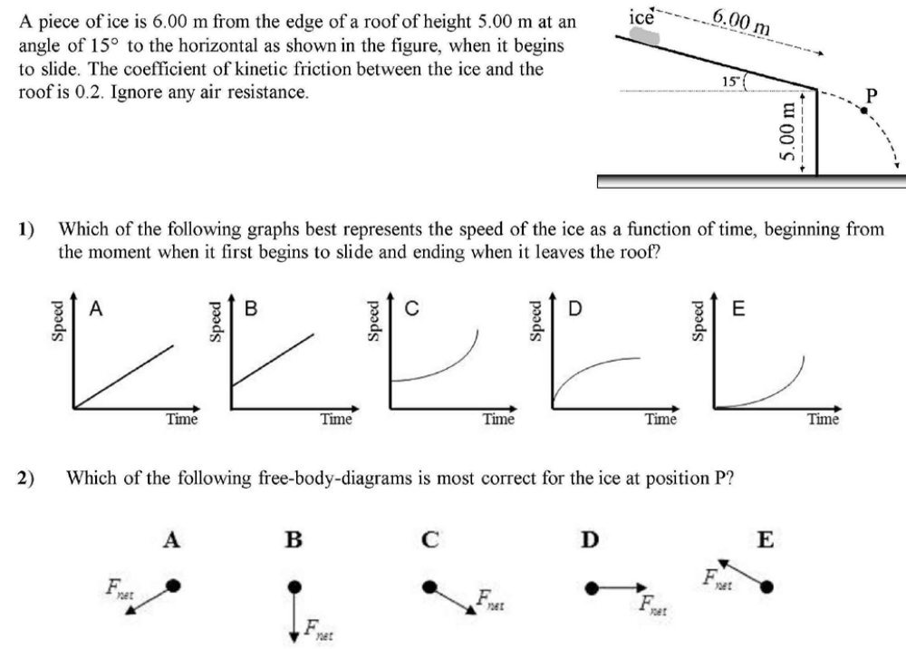
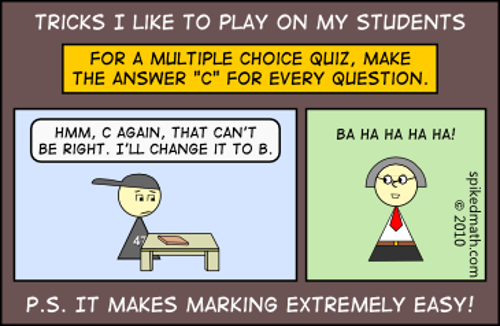

## Multiple Choice Tests

We are all (hopefully?) familiar with basic multiple choice tests. A (joking) example:

Which of the following is the most different from the others?

* (A) A Ph.D. in Mathematical Biology
* (B) A Ph.D. in Theoretical Mathematics
* (C) A Ph.D. in Statistics
* (D) A large pepperoni pizza

**Answer**: (B), the other three can feed a family of four.

--- .class #id

## Multiple Choice (MC) Tests

Characteristics of multiple choice tests:

* large number of assumed conditionally independent **items** (questions)
* performance (percentage correct) assumed to represent proficiency
* no scoring variance (scorer interpretation and bias)
* no topic effects (breadth allows for topic coverage)

Highly efficient: we use these tests because of the reality of resources (or lack thereof).

--- .class #id

## How do we interpret?

* Item Response Theory (IRT) is a family of models that try to describe (probabilistically) what happens when an item meets an examinee
* classical IRT models have conditional local independence as a primary requirement
* connected questions are, by construction, not independent or conditionally independent
* need a framework in which the fungible unit is larger than a single item, but smaller than the entire test, with the units conditionally independent

--- .class #id

## Testlets

Originally proposed as the required "larger" fungible unit.

* aggregation of items grouped together to act as a unit
* typically with a common stem (prompt, question)
* has a within-testlet dependence
* for Computer Adaptive Testing, act as atoms (non-adaptive internally)

Some quite nice theory has been developed for dealing with these objects, called *Testlet Response Theory (TRT)*.

--- .class #id

## Answer-Until-Correct (IF-AT)

Technological developments now allow for students to "answer until correct", within frameworks such as the Immediate Feedback Assessment Technique (IF-AT).

* multiple choice, single correct keyed response
* students select option
* if incorrect, immediately informed of fact
* allowed to choose again, receiving a penalty
* iterate until options exhausted or correct (keyed) answer found

Can be viewed as a form of collaborative testing, with the until-correct serving as passive instructor communication with examinee.

--- .class #id

## Integrated Testlets?

Integrated testlets are testlets with:

* interrelation of multiple choice items
* knowledge of one item solution is useful, or more often, necessary for the other items
* obviously **not** independent, or even conditionally independent
    * correlated or auto-correlated structure
* answer-until-correct prevents double jeopardy, and allows progression

Denoted in literature as "weakly", "moderately", or "strongly" **integrated**, based on degree of inter-relation.

--- .class #id

## Example (Part 1 of 4) 

--- .class #id

## Scoring Schemes

With answer-until-correct, there are a variety of scoring schemes available. If there is one keyed response and three distractors, some options are:

* (1.0, 0.5, 0.1, 0.0) (average)
* (1.0, 1.0, 0.5, 0.1) (very generous)
* (1.0, 0.3, 0.0, 0.0) (harsh?)

and so on, depending on the desire for partial credit and discrimination of items.

Empirically, several examinations of this approach have found that adding any reasonable partial credit scheme slightly boosts average scores, but does not affect discrimination.

--- .class #id

## The 2-PL Model

The **2-PL** TRT model was designed for dichotomous test item data (binary):

$$
P_{ij}\left(y_{ij} = 1 \Big| t_{ij} \right) = \frac{\text{exp}(t_{ij})}{1 + \text{exp}(t_{ij})} = \text{logit}^{-1}(t_{ij})
$$
with $t_{ij}$ the latent linear predictor of the score and $y_{ij} \in \{ 0, 1 \}$ the response score from subject $i$ on item $j$.

In the standard 2-PL IRT model, $t_{ij} = a_j(\theta_i - b_j)$, but for the 2-PL TRT model, it is extended to 
$$
t_{ij} = a_j(\theta_i - b_j - \gamma_{id(j)}).
$$
For both of these, $\theta_i$ is the ability for subject $i$, $a_j$ is the discrimination for item $j$, and $b_j$ is the difficulty for item $j$. The additional term for the TRT version incorporates the dependence from two items $j$ and $j'$ being in the same testlet: the testlet effect when the subject is confronted with item $j$ nested within testlet $d(j)$.

---  .class #id

## The 3-PL Model

There are two issues with the 2-PL model:

* the model does not gracefully handle subject responses being guesses
* testlets may exhibit markedly differing amounts of testlet dependence

The update which incorporates pathways for both of these issues is:
$$
P(y_{ij} = 1) = c_j + (1-c_j) \cdot \text{logit}^{-1}\left( a_j(\theta_i - b_j - \gamma_{id(j)})\right)
$$
where $c_j$ is the "guessing parameter" of item $j$.

For example, for a four-item (one key, three distractor) item, $c_j$ might be set to $0.25$ (or estimated).

--- .class #id

## Estimation

Estimation of this model can be done using a MCMC framework, with priors:

$$
\begin{split}
\theta_i &\sim  \mathcal{N}(0,1) \\
\log(a_j) &\sim \mathcal{N}(\mu_a, \sigma_a^2) \\
b_j &\sim \mathcal{N}(\mu_b, \sigma_b^2)\\
\text{logit}(c_j) &\sim \mathcal{N}(\mu_c, \sigma_c^2)
\end{split}
$$
with weakly informative conjugate hyperpriors placed on $\mu_a$ through $\sigma_c^2$. 

This can be done in any available environment, including a nicely hand-written Gibbs sampler (if desired ...).

--- .class #id

## Extension to Integrated Testlets

So there is a well established theory which seems to work reasonably well under a subset of IRT (Testlet Response Theory), with some reasonably gentle assumptions. 

The model controls for guessing, interdependence among testlet items (in a correlation sense) and has a well-understood Bayesian modeling framework which allows for estimation of posterior densities.

What's required for integrated testlets?

<b>Explicitly model the relationship between the items of the testlet, and their inherent serial correlation (if present)</b>.

--- .class #id

## Take-Aways

* Most of us who teach large intro classes use multiple choice as a convenience
* We mostly forget everything we were taught <b>as statisticians</b>, and just flail in the direction of the test
    * No verification
    * No quantitative examination of quality
    * No understanding of the model by which students answer our tests
    * Limited revision and replacement of problems based on discrimination
* We can do better!
* There's a rich body of work and active development happening which is worth paying attention to 

--- .class #id

## Or we could just ...

Thank you for being here on Wednesday morning!

